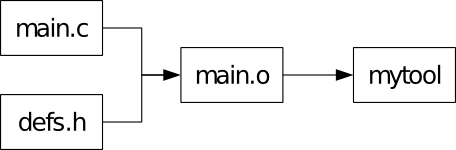
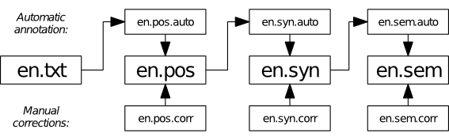
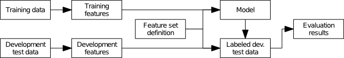

produce
=======

Produce is an incremental build system for the command line, like Make or redo.
It strives to be simple and user-friendly. It is less geared towards compiling
code, and more towards processing data and running sets of machine learning
experiments. Specifically, it works well with filenames that have not just one
but many variable parts, e.g. to indicate experimental parameters.

<!-- START doctoc generated TOC please keep comment here to allow auto update -->
<!-- DON'T EDIT THIS SECTION, INSTEAD RE-RUN doctoc TO UPDATE -->
**Table of Contents**  *generated with [DocToc](http://doctoc.herokuapp.com/)*

- [Requirements](#requirements)
- [Obtaining Produce](#obtaining-produce)
- [Installing Produce](#installing-produce)
- [Usage](#usage)
- [Motivation](#motivation)
- [Build automation: basic requirements](#build-automation-basic-requirements)
- [Make syntax vs. Produce syntax and a tour of the basic features](#make-syntax-vs-produce-syntax-and-a-tour-of-the-basic-features)
  - [Rules, expansions, escaping and comments](#rules-expansions-escaping-and-comments)
  - [Named and unnamed dependencies](#named-and-unnamed-dependencies)
  - [Multiple wildcards, regular expressions and matching conditions](#multiple-wildcards-regular-expressions-and-matching-conditions)
  - [Special targets vs. special attributes](#special-targets-vs-special-attributes)
  - [Python expressions and global variables](#python-expressions-and-global-variables)
- [Reference of advanced topics](#reference-of-advanced-topics)
  - [Whitespace and indentation in values](#whitespace-and-indentation-in-values)
  - [`shell`: choosing the recipe interpreter](#shell-choosing-the-recipe-interpreter)
  - [The prelude](#the-prelude)
  - [All special attributes at a glance](#all-special-attributes-at-a-glance)
    - [In rules](#in-rules)
    - [In the global section](#in-the-global-section)
- [Running Produce](#running-produce)
  - [When a recipe fails](#when-a-recipe-fails)
  - [How targets are matched against rules](#how-targets-are-matched-against-rules)
- [Internals](#internals)
  - [The build algorithm](#the-build-algorithm)
- [Getting in touch](#getting-in-touch)

<!-- END doctoc generated TOC please keep comment here to allow auto update -->

Requirements
------------

* A Unix-like operating system such as Linux or Mac OS X. Cygwin under Windows
  may also work.
* Python 3
* Git (for downloading Produce)

Obtaining Produce
-----------------

Donload Produce by running the following command in a convenient location:

    git clone https://github.com/texttheater/produce

This will create a directory called `produce`. To update to the latest version
of Produce later, you can just go into that directory and run:

    git pull

Installing Produce
------------------

The `produce` directory contains an executable Python script also called
`produce`. This is all you need to run Produce. Just make sure it is in your
`PATH`, e.g. by copying it to `/usr/local/bin` or by linking to it from your
`$HOME/bin` directory.

Usage
-----

When invoked, Produce will first look for a file called `produce.ini` in the
current working directory. Its format is documented in this document. If you
want a quick start, have a look at
[an example project](https://github.com/texttheater/produce/tree/master/doc/samples/tokenization).

You may also have a look at the
[PyGrunn 2014 slides](https://texttheater.github.io/produce-pygrunn2014)
for a quick introduction.

Motivation
----------

Produce is a build automation tool. Build automation is useful whenever you
have one or several input files from which one or several output files are
generated automatically – possibly in multiple steps, so that you have
intermediate files.

The classic case for this is compiling C programs, where a simple project might
look like this:

But build automation is also useful in other areas, such as science. For
example, in the [Groningen Meaning Bank](http://gmb.let.rug.nl/) project, a
Natural Language Processing pipeline is combined with corrections from human
experts to build a collection of texts with linguistic annotations in a
bootstraping fashion.

In the following simplified setup, processing starts with a text file
(`en.txt`) which is first part-of-speech-tagged (`en.pos`), then analyzed
syntactically (`en.syn`) by a parser and finally analyzed semantically
(`en.sem`). Each step is first carried out automatically by an NLP tool
(`*.auto`) but then corrections by human annotators (`*.corr`) are applied
to build the main version of the file which then serves as input to further
processing. Every time a new human correction is added, parts of the
pipeline must be re-run:

Or take running machine learning experiments: we have a collection of labeled
data, split into a training portion and testing portions. We have various
feature sets and want to know which one produces the best model. So we train a
separate model based on each feature set and on the training data, and generate
corresponding labeled outputs and evaluation reports based on the development
test data:

A [number](http://kbroman.github.io/minimal_make/)
[of](http://bost.ocks.org/mike/make/) [articles](http://zmjones.com/make/)
point out that build automation is an invaluable help in setting up experiments
in a self-documenting manner, so that they can still be understood, replicated
and modified months or years later, by you, your colleagues or other
researchers. Many people use Make for this purpose, and so did I, for a while.
I specifically liked:

* *The declarative notation.* Every step of the workflow is expressed as a
  _rule_, listing the _target_, its direct dependencies and the command to run
  (the _recipe_). Together with a good file naming scheme, this almost
  eliminates the need for documentation.
* *The Unix philosophy.* Make is, at its core, a thin wrapper around shell
  scripts. For orchestrating the steps, you use Make, and for executing them,
  you use the full power of shell scripts. Each tool does one thing, and does
  it well. This reliance on shell scripts is something that sets Make apart
  from specialized build tools such as Ant or A-A-P.
* *The wide availability.* Make is installed by default on almost every Unix
  system, making it ideal for disseminating and exchanging code because the
  Makefile format is widely known and can be run everywhere.

So, if Make has so many advantages, why yet another build automation tool?
There are two reasons:

* Make’s syntax. Although the basic syntax is extremely simple, as soon as you
  want to go a _little bit_ beyond what it offers and use more advanced
  features, things get quite arcane very quickly.
* Wildcards are quite limited. If you want to match on the name of a specific
  target to generate its dependencies dynamically, you can only use one
  wildcard. If your names are a bit more complex than that, you have to resort
  to black magic like Make’s built-in string manipulation functions that don’t
  compare favorably to languages like Python or even Perl, or rely on external
  tools. In either case, your Makefiles become extremely hard to read, bugs
  slip in easily and the simplicity afforded by the declarative paradigm is
  largely lost.

Produce is thus designed as a tool that copies Make’s virtues and improves a
great deal on its deficiencies by using a still simple, but much more powerful
syntax for mapping targets to dependencies. Only the core functionality of Make
is mimicked – advanced functions of Make such as built-in rules specific to
compiling C programs are not covered. Produce is general-purpose.

Produce is written in Python 3 and scriptable in Python 3. Whenever I write
Python below, I mean Python 3.

Build automation: basic requirements
------------------------------------

Let’s review the basic functionality we expect of a build automation tool:

* Allows you to run multiple steps of a workflow with a single command, in the
  right order.
* Notices when inputs have changed and runs exactly those steps again that are
  needed to bring the outputs up to speed, no more or less.
* Intermediate files can be deleted without affecting up-to-dateness – if the
  outputs are newer than the inputs, the workflow will not be re-run.

Make syntax vs. Produce syntax and a tour of the basic features
---------------------------------------------------------------

When you run the `produce` command (usually followed by the targets you want
built), Produce will look for a file in the current directory, called
`produce.ini` by default. This is the “Producefile”. Let’s introduce
Producefile syntax by comparing it to Makefile syntax.

### Rules, expansions, escaping and comments

Here is a Makefile for a tiny C project:

    # Compile
    %.o : %.c
    	cc -c $<
    
    # Link
    % : %.o
    	cc -o $@ $<

And here is the corresponding `produce.ini`:

    # Compile
    [%{name}.o]
    dep.c = %{name}.c
    recipe = cc -c %{c}
    
    # Link
    [%{name}]
    dep.o = %{name}.o
    recipe = cc -o %{target} %{o}

Easy enough, right? Produce syntax is a dialect of the widely known INI syntax,
consisting of sections with headings in square brackets, followed by
attribute-value pairs separated by `=`. In Produce’s case, sections represent
_rules_, the section headings are _target patterns_ matching _targets_ to
build, and the attribute-value pairs specify the target’s direct dependencies
and the recipe to run it.

Dependencies are typically listed each as one attribute of the form `dep.name`
where `name` stands for a name you give to the dependency – e.g., its file
type. This way, you can refer to it in the recipe using an _expansion_.

Expansions have the form `%{...}`. In the target pattern, they are used as
wildcards. When the rule is invoked on a specific target, they match any string
and assign it to the variable name specified between the curly braces. In
attribute values, they are used like variables, expanding to the value
associated with the variable name. Besides target matching, values can also be
assigned to variable names by attribute-value pairs, as with e.g.
`dep.c = %{name}.c`. Here, `c` is the variable name; the `dep.` prefix just
tells Produce that this particular value is also a dependency.

If you need a literal percent sign in some attribute value, you need to escape
it as `%%`.

The `target` variable is automatically available when the rule is invoked,
containing the target matched by the target pattern.

Lines starting with `#` are for comments and ignored.

So far, so good – a readable syntax, I hope, but a bit more verbose than that
of Makefiles. What does this added verbosity buy us? We will see in the next
subsections.

### Named and unnamed dependencies

To see why naming dependencies is a good idea, consider the following Makefile
rule:

    out/%.pos : out/%.pos.auto out/%.pos.corr
    	./src/scripts/apply_corrections $< \
            --corrections out/$*.pos.corr > $@

This could be from the Natural Language Processing project we saw as the second
example above: the rule is for making the final `pos` file from the
automatically generated `pos.auto` file and the `pos.corr` file with manual
corrections, thus it has two direct dependencies, specified on the first line.
The recipe refers to the first dependency using the shorthand `$<`, but there
is no such shorthand for other dependencies. So we have to type out the second
dependency again in the recipe, taking care to replace the wildcard `%` with
the magic variable `$*`. This is ugly because it violates the golden principle
“Don’t repeat yourself!” If we write something twice in a Makefile, not only is
it more work to type, but also if we want to change it later, we have to change
it in two places, and there’s a good chance we’ll forget that.

Produce’s named dependencies avoid this problem: once specified, you can refer
to every dependency using its name. Here is the Produce rule corresponding to
the above Makefile rule:

    [out/%{name}.pos]
    dep.auto = %{name}.pos.auto
    dep.corr = %{name}.pos.corr
    recipe = ./src/scripts/apply_corrections %{auto} %{corr} > %{target}

Note that you don’t _have_ to name dependencies. Sometimes you don’t need to
refer back to them. Here is an example rule that compiles a LaTeX document:

    [%{name}.pdf]
    deps = %{name}.tex bibliography.bib
    recipe =
    	pdflatex %{name}
    	bibtex %{name}
    	pdflatex %{name}
    	pdflatex %{name}

The TeX tools are smart enough to fill in the file name extension if we just
give them the basename that we got by matching the target. In such cases, it
can be more convenient not to name the dependencies and list them all on one
line. This is what the `deps` attribute is for. It is parsed using Python’s
[`shlex.split`](https://docs.python.org/3/library/shlex.html?highlight=shlex#shlex.split)
function – consult the Python documentation for escaping rules and such. You
can also mix `deps.*` attributes and `deps` in one rule.

Note that, as in many INI dialects, attribute values (here: the recipe) can
span multiple lines as long as each line after the first is indented. See
[Whitespace and indentation in values](#whitespace-and-indentation-in-values)
below for details.

#### Dependency files

Sometimes the question which other files a file depends on is more complex and
may change frequently over the lifetime of a project, e.g. in the cases of
source files that import other header files, modules etc. In such cases, it
would be nice to have the dependencies automatically listed by a script.
Produce supports this via the `depfile` attribute in rules: here, you can
specify the name of a _dependency file_, a text file that contains
dependencies, one per line. Produce will read them and add them to the list of
dependencies for the matched target. Also, Produce will try to produce the
dependency file (i.e. make it up to date) _prior_ to reading it. So you can
write another rule that tells Produce how to generate each dependency file, and
the rest is automatic.

For example, the following rule might be used to generate a dependency file
listing the source file and header files required for compiling a C object.
This example uses `.d` as the extension for dependency files. It runs `cc -MM`
to use the C compiler’s dependency discovery feature and then some shell magic
to convert the output from a Makefile rule into a simple dependency list:

    [%{name}.d]
    dep.c = %{name}.c
    recipe =
        cc -MM -I. %{name} | sed -e 's/.*: //' | sed -e 's/^ *//' | \
        perl -pe 's/ (\\\n)?/\n/g' > %{target}

The following rule could then be used to create the actual object file. The
`depfile` attribute makes sure that whenever an included header file changes,
the object file will be rebuilt:

    [%{name}.o]
    dep.src = %{name}.c
    depfile = %{name}.d
    recipe =
        cc -c -o %{target} %{src}

Note that the `.c` file will end up in the dependency list twice, once from
`dep.src` and once from the dependency file. This does not matter, Produce is
smart enough not to do the same thing twice.

### Multiple wildcards, regular expressions and matching conditions

The ability to use more than one wildcard in target patterns is Produce’s
killer feature because to this date I have not been able to find a single other
build automation tool that offers it. Rake and others do offer full regular
expressions which are strictly more powerful but not as easy to read. Don’t
worry, Produce supports them too and more, we will come to that. But first
consider the following Produce rule, which might be found in the third example
project we saw in the introduction, the machine learning one:

    [out/%{corpus}.%{portion}.%{fset}.labeled]
    dep.model = out/%{corpus}.train.%{fset}.model
    dep.input = out/%{corpus}.%{portion}.feat
    recipe = wapiti label -m %{model} %{input} > %{target}

Labeled output files here follow a certain naming convention: four parts,
separated by periods. The first one specifies the data collection (e.g. a
linguistic corpus), the second one the portion of the data that is
automatically labeled in this step (either the development portion or the test
portion), the third one specifies the feature set used and the fourth one is
the extension `labeled`. For each of the three first parts, we use a wildcard
to match it. We can then freely use these three wildcards to specify the
dependencies: the model we use for labelling depends on the corpus and on the
feature set but not on the portion to label: the portion used for training the
model is always the training portion. The input to labelling is a file
containing the data portion to label, together with the extracted features. We
assume that this file always contains all features we can extract even if we’re
not going to use them in a particular model, so this dependency does not depend
on the feature set.

A Makefile rule to achieve something similar would look something like this:

    .SECONDEXPANSION:
    out/%.labeled : out/$$(subst test,train,$$(subst dev,train,$$*)).model \
                    out/$$(basename $$*).feat
            wapiti label -m $< out/$(basename $*).feat > $@

If you are like me, this is orders of magnitude less readable than the Produce
version. Getting a Makefile rule like this to function properly will certainly
make you feel smart, but hopefully also feel miserable about the brain cycles
wasted getting your head around the bizarre syntax, the double dollars and the
second expansion.

A wildcard will match _anything_. If you need more control about which targets
are matched, you can use a
[Python regular expression](https://docs.python.org/3/library/re.html?highlight=re#module-re)
between slashes as the target pattern. For example, if we want to make sure
that our rule only matches targets where the second part of the filename is
either `dev` or `test`, we could do it like this:

    [/out/(?P<corpus>.*)\.(?P<portion>dev|test)\.(?P<fset>.*)\.labeled/]
    dep.model = out/%{corpus}.train.%{fset}.model
    dep.input = out/%{corpus}.%{portion}.feat
    recipe = wapiti label -m %{model} %{input} > %{target}

The regular expression in this rule’s header is almost precisely what the above
header with three wildcards is translated to by Produce internally, with the
difference that the subexpression matching the second part is now `dev|test`
rather than `.*`. We are using a little-known feature of regular expressions
here, namely the `(?P<...>)` syntax that allows us to assign names to
subexpressions by which you can refer to the matched part later.

Note the slashes at the beginning and end are just a signal to Produce to
interpret what is in-between as a regular expressions. You do not have to
escape slashes within your regular expression.

While regular expressions are powerful, they make your Producefile less
readable. A better way to write the above rule is by sticking to ordinary
wildcards and using a separate _matching condition_ to check for `dev|test`:

    [out/%{corpus}.%{portion}.%{fset}.labeled]
    cond = %{portion in ('dev', 'test')}
    dep.model = out/%{corpus}.train.%{fset}.model
    dep.input = out/%{corpus}.%{portion}.feat
    recipe = wapiti label -m %{model} %{input} > %{target}

A matching condition is specified as the `cond` attribute. We can use any
Python expression. It is evaluated only if the target pattern matches the
requested target. If it evaluates to a “truthy” value, the rule matches and
the recipe is executed. If it evaluates to a “falsy” value, the rule does
not match, and Produce moves on, trying to match the next rule in the
Producefile.

Note that the Python expression is given as an expansion. At this point we
should explain three fine points:

1. Whenever we used expansions so far, the variable names inside were actually
   Python expressions, albeit of a simple kind: single variable names. But as
   we see now, we can use arbitrary Python expressions. Expansions used as
   wildcards in the target pattern are an exception, of course: they can only
   consist of a single variable name.
2. The variables we use in rules are actually Python variables.
3. Attribute values are always strings, so if a Python expression is used to
   generate (part of) an attribute value, not the value of the expression
   itself is used but whatever its `__str__` method returns. Thus, in the
   above rule, the value of the `cond` variable is not `True` or `False`, but
   `'True'` or `'False'`. In order to interpret the value as a Boolean, Produce
   calls
   [ast.literal\_eval](https://docs.python.org/3/library/ast.html?highlight=literal_eval#ast.literal_eval)
   on the string. So if the string contains anything other than a literal
   Python expression, this is an error.

### Special targets vs. special attributes

Besides not naming all dependencies, there is another reason why Make’s syntax
is too simple for its own good. When some rule needs to have a special
property, Make usually requires a “special target” that syntactically looks
like a target but is actually a declaration and has no obvious visual
connection to the rule(s) it applies to. We have already seen an example of the
dreaded `.SECONDEXPANSION`. Another common special target is `.PHONY`, marking
targets that are just jobs to be run, without producing an output file. For
example:

    .PHONY: clean
    clean:
    	rm *.o temp

It would be easier and more logical if the “phoniness” was declared as part of
the rule rather than some external declaration. This is was Produce does. The
Produce equivalent of declaring targets phony is to set the `type` attribute of
their rule to `task` (the default is `file`). With this the rule above is
written as follows:

    [vacuum]
    type = task
    recipe = rm *.o temp

Note that since it is ungrammatical to “produce a clean”, I invented a naming
convention according to which the task that cleans up your project directory is
called `vacuum` because it produces a vacuum. It’s silly, I know.

For other special attributes besides `task`, see [All special attributes at a
glance](#all-special-attributes-at-a-glance) below.

### Python expressions and global variables

As we have already seen, Produce’s expansions can contain arbitrary Python
expressions. This is not only useful for specifying Boolean matching
conditions, but also for string manipulation, in particular for playing with
dependencies. This is a pain in Make, because Make implements its own string
manipulation language which from today’s perspective (since we have Python)
not only reinvents the wheel, but reinvents it poorly, with a rather dangerous
syntax. Consider the following (contrived) example from the GNU Make manual
where you have a list of dependencies in a global variable and filter them to
retain only those ending in `.c` or `.s`:

    sources := foo.c bar.c baz.s ugh.h
    foo: $(sources)
    	cc $(filter %.c %.s,$(sources)) -o foo

With Produce, we can just hand the string manipulation to Python, a language
we already know and (hopefully) like:

    []
    sources = foo.c bar.c baz.s ugh.h

    [foo]
    deps = %{sources}
    recipe = cc %{' '.join([f for f in sources.split() \
    		if f.endswith('.c') or f.endswith('.s')])}

This example also introduces the _global section_, a section headed by `[]`,
thus named with the empty string. The attributes here define global variables
accessible from all rules. The global section may only appear once and only at
the beginning of a Producefile.

Reference of advanced topics
----------------------------

### Whitespace and indentation in values

An attribute value can span multiple lines as long as each line after the first
is indented with some whitespace. The recommended indentation is either one tab
or four spaces. If you make use of this, it is recommended to leave the first
line (after the attribute name and the `=`) blank so all lines of the value are
consistently aligned.

The _second_ line of a value (i.e. the first indented one) determines the kind
and amount of whitespace expected to start each subsequent line. This
whitespace will _not_ be part of the attribute value. _Additional_ whitespace
after the initial amount is, however, preserved. This is important e.g. for
Python code and the reason why Produce is no longer using Python’s
`configparser` module.

All whitespace at the very beginning and at the very end of an attribute value
will be stripped away.

### `shell`: choosing the recipe interpreter

By default, recipes are (after doing expansions) handed to the `bash` command
for execution. If you would rather write your recipe in `zsh`, `perl`, `python`
or any other language, that’s no problem. Just specify the interpreter in the
`shell` attribute of the rule.

### The prelude

If you use Python expressions in your recipes, you will often need to import
Python modules or define functions to use in these expressions. You can do
this by putting the imports, function definitions and other Python code into
the special `prelude` attribute in the
[global section](#python-expressions-and-global-variables).

### All special attributes at a glance

For your reference, here are all the rule attributes that currently have a
special meaning to Produce:

#### In rules

<dl>
    <dt><code>target</code></dt>
    <dd>When a rule matches a target, this variable is always set to that
    target, mainly so you can refer to it in the recipe. It is illegal to set
    the <code>target</code> attribute yourself. Also see
    <a href="#rules-expansions-escaping-and-comments">Rules, expansions, escaping and comments</a>.</dd>
    <dt><code>cond</code></dt>
    <dd>Allows to specify a _matching condition_ in addition to the target
    pattern. Typically it is given as a single expansion with a boolean Python
    expression. It is expanded immediately after a target matches the rule. The
    resulting string must be a Python literal. If “truthy”, the rule matches
    and its expansion/execution continues. If “falsy”, the rule does not match
    the target and Produce proceeds with the next rule, trying to match the
    target. Also see <a href="#multiple-wildcards-regular-expressions-and-matching-conditions">Multiple wildcards, regular expressions and matching conditions</a>.</dd>
    <dt><code>dep.*</code></dt>
    <dd>The asterisk stands for a name chosen by you, which is the actual name
    of the variable the attribute value will be assigned to. The <code>dep.</code> prefix,
    not part of the variable name, tells Produce that this is a dependency,
    i.e. that the target given by the value must be made up to date before the
    recipe of this rule can be run. Also see
    <a href="#named-and-unnamed-dependencies">Named an unnamed depenencies</a>.</dd>
    <dt>deps</dt>
    <dd>Like <code>dep.*</code>, but allows for specifying multiple unnamed dependencies
    in one attribute value. The format is roughly a space-separated list. For
    details, see
    <a href="https://docs.python.org/3/library/shlex.html?highlight=shlex#shlex.split"><code>shlex.split</code></a>.
    Also see <a href="#named-and-unnamed-dependencies">Named an unnamed depenencies</a>.</dd>
    <dt><code>depfile</code></dt>
    <dd>Another way to specify (additional) dependencies: the name of a file
    from which dependencies are read, one per line. Additionally, Produce will
    try to make that file up to date prior to reading it. Also see
    <a href="#dependency-files">Dependency files</a>.</dd>
    <dt><code>type</code></dt>
    <dd>Is either <code>file</code> (default) or <code>task</code>. If <code>file</code>, the target is supposed
    to be a file that the recipe creates/updates if it runs successfully. If
    <code>task</code>, the target is an arbitrary name given to some task that the recipe
    executes. Crucially, task-type targets are always assumed to be out of
    date, regardless of the possible existence and age of a file with the same
    name. Also see
    <a href="#special-targets-vs-special-attributes">Special targets vs. special attributes</a></dd>
    <dt><code>recipe</code></dt>
    <dd>The command(s) to run to build the target, typically a single shell
    command or a short shell script. Unlike Make, each line is not run in
    isolation, but the whole script is passed to the interpreter as a whole,
    after doing expansions. This way, you can e.g. define a shell variable
    on one line and use it on the next. Also see
    <a href="#rules-expansions-escaping-and-comments">Rules, expansions, escaping and comments</a>.</dd>
    <dt><code>shell</code></dt>
    <dd>See <a href="#shell-choosing-the-recipe-interpreter"><code>shell</code>: choosing the recipe interpreter</a></dd>
</dl>

#### In the global section

<dl>
    <dt><code>default</code></dt>
    <dd>A list
    (parsed by <a href="https://docs.python.org/3/library/shlex.html?highlight=shlex#shlex.split"><code>shlex.split</code></a>)
    of default targets that are produced if the user does not specify any
    targets when calling Produce.</dd>
    <dt><code>prelude</code></dt>
    <dd>See <a href="#the-prelude">The prelude</a></dd>
</dl>

Running Produce
---------------

Produce is invoked from the command line by the command `produce`, usually
followed by the target(s) to produce. These can be omitted if the Producefile
specifies one or more default targets. By default, Produce will look for
`produce.ini` in the current working directory and complain if it does not
exist.

A number of options can be used to control Produce’s behavior, as listed in its
help message:

    usage: produce [-h] [-B] [-f FILE] [-n] [-d] [target [target ...]]
    
    positional arguments:
      target                the target(s) to produce - if omitted, default target
                            from producefile is used
    
    optional arguments:
      -h, --help            show this help message and exit
      -B, --always-build    unconditionally build all targets
      -f FILE, --file FILE  use FILE as a producefile
      -n, --dry-run         print the commands that would be executed, but do not
                            execute them
      -d, --debug           print debugging information

### When a recipe fails

When a recipe fails, i.e. its interpreter returns an exit status other than 0,
the corresponding target file (if any) may already have been created or
touched, potentially leading the next invocation of Produce to believe that it
is up to date, even though it probably doesn’t have the correct contents. Such
inconsistencies can lead to users tearing their hair out. In order to avoid
this, Produce will, when a recipe fails, make sure that the target file does
not stay there. It could just delete it, but that might be unwise because the
user might want to inspect the output file of the erroneous recipe for
debugging. So, Produce renames the target file by appending a `~` to the
filename (a common naming convention for short-lived “backups”).

### How targets are matched against rules

When producing a target, either because asked to by the user or because the
target is required by another one, Produce will always work through the
Producefile from top to bottom and use the first rule that matches the target.
A rule matches a target if both the target pattern matches and the matching
condition (if any) subsequently evaluates to true.

Note that unlike most INI dialects, Produce allows for multiple sections with
the same heading. It makes sense to have the same target pattern multiple times
when there are matching conditions to make subdistinctions.

If no rule matches a target, Produce aborts with an error message.

Internals
---------

### The build algorithm

In [Build automation: basic requirements](#build-automation-basic-requirements)
above, I outlined what we expect from a build automation tool’s core
functionality. There is a fairly simple algorithm that achieves this and must
have been implemented hundreds of times, but getting it right has a few
subtleties and I did not find any description out there that addresses all the
relevant details. So I thought I’d write one down here. This is how Produce
works:

In the first phase, a dependency graph is built by recursively processing
targets and their dependencies, and other information about targets is
gathered. Starting from the targets requested by user, for each target,

1. abort with error if we detect a cyclic dependency
2. return if we already processed this target (nothing to do)
3. determine which rule to use (first that matches)
4. list the direct dependencies, process them recursively
5. determine the target type: `file` or `task`
6. determine whether target is _missing_
7. determine target _time_
8. determine whether target is _out of date_

For the last four steps, we need to have the dependencies processed before.
This is why we need this “info gathering” phase before actually starting to
build.

A target is _missing_ if and only if its type is `file` and it does not exist.

A target is _out of date_ if any of these conditions holds:

1. its type is `task`
2. some direct dependency is newer
3. some direct dependency is out of date
4. the “always build” option `-B` is on

Finally, what does it mean for a target to be _newer_ than another? This is
determined as follows:

* The time of a task is `0`.
* The time of a missing file is the time of its newest direct dependency (or
  `0` if it has no dependencies)
* The time of an existing file is its last-modified time.

In the second phase, for each target requested by the user, we check if it is
out of date or missing. If so, we _build_ it, meaning that we first perform
the same action recursively for each direct dependency and then run the recipe
to create/update the target. Finally, we mark the target as no longer out of
date or missing. In pseudocode:

    def build_if_necessary(target):
        if target in out_of_date or target in missing:
            build(target)
            out_of_date.discard(target)
            missing.discard(target)

    def build(target):
        for dd in direct_dependencies[target]:
            build_if_necessary(dd)
        run_recipe(target)

Getting in touch
----------------

Produce is being developed by Kilian Evang <%{firstname}@%{lastname}.name>.
I would love to hear from you if you find it useful, if you have questions, bug
reports or feature requests.
